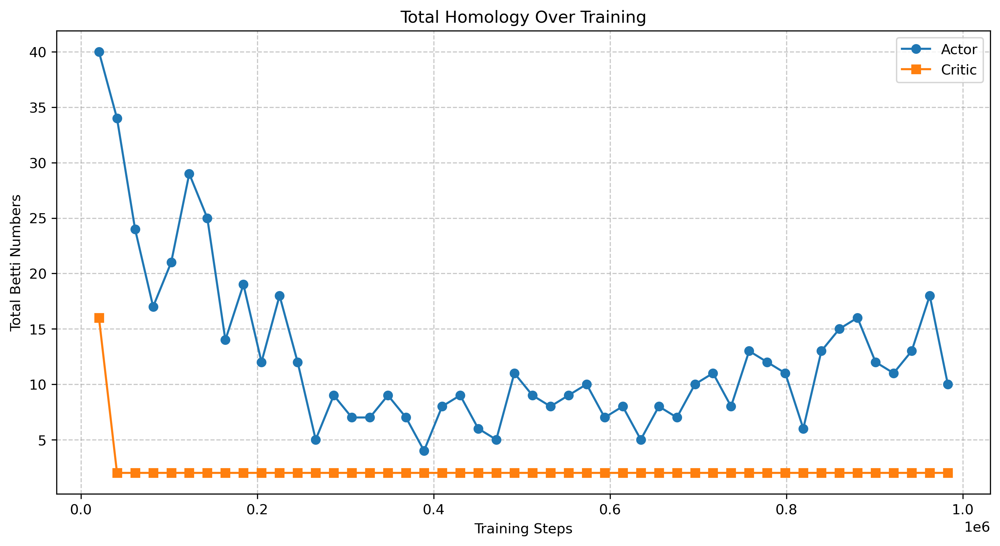

# NeuralTopology
This is a MVP repository for trying to understand what's truely happening inside the weight space of neural network when they are training upon specific tasks. Particularly, this will develope into seeing how the VNL system from [Talmo's lab](https://talmolab.org/) at the Salk Institute for Biological Studies may evolve different topological characteristics across DRL training.

## Expected Outcome 🧪
1. Helping us to better understand what is truly happening inside neural network
2. Providing another metric of comparing with experimental neuronal data (~homeomorphic).

## Preliminary 📝
Examining the training of an mujoco hopper agent. We can see the saturation of represenation as training progresses:

| Actor Topology at 20480 Environmental Step    | Critic Topology at 20480 Environmental Step           |
|--------------------------------------|--------------------------------------|
|  |  |
| Actor Topology at 532480 Environmental Step   | Critic Topology at 532480 Environmental Step          |
|  |  |
| Betti Number Trend   | Hopper Rendering at 532480 Step          |
|  |  |

The training runs and topological characteristic changes over time are also captured in this [wandb training log](https://wandb.ai/kaiwenbian107/hopper_ppo_topology_analysis?nw=nwuserkaiwenbian107)

## Acknowledgements
This codebase structure implementation is based on the paper ["TOPOLOGY OF DEEP NEURAL NETWORKS"](https://arxiv.org/pdf/2004.06093).