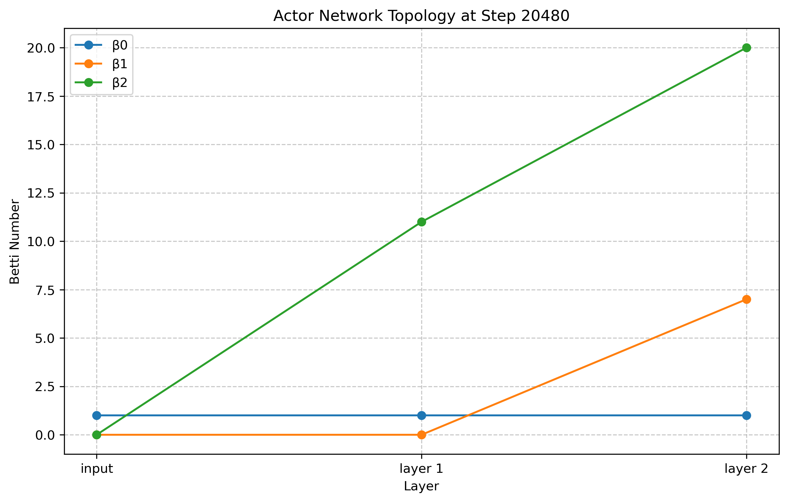
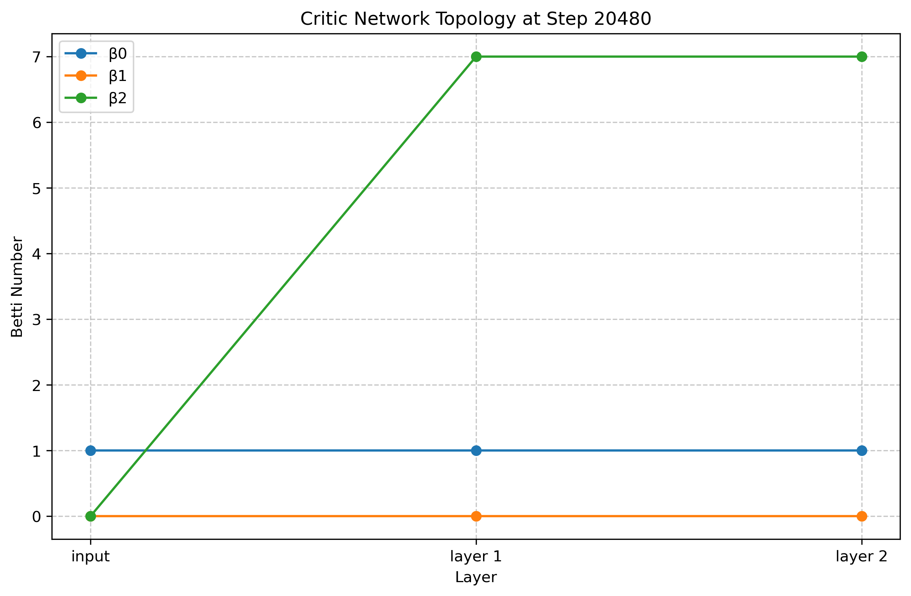
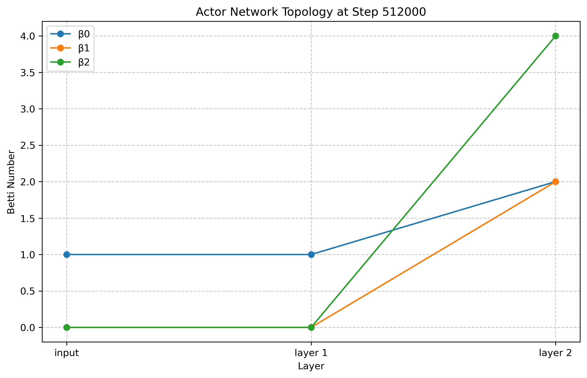
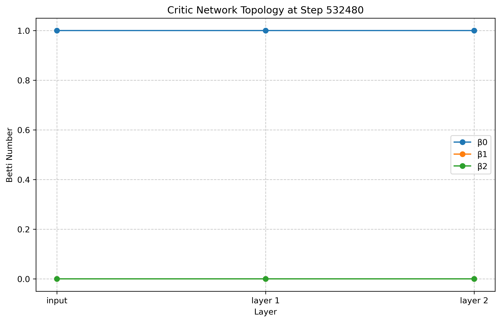
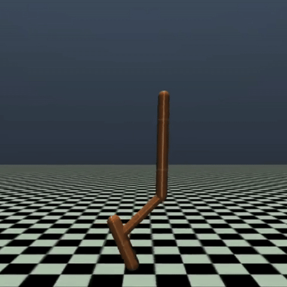

# NeuralTopology
...

## Preliminary

Examining the training of an mujoco hopper agent. We can see the saturation of represenation as training progresses:

| Actor Topology at 20480 Environmental Step    | Critic Topology at 20480 Environmental Step           |
|--------------------------------------|--------------------------------------|
|  |  |
| Actor Topology at 532480 Environmental Step   | Critic Topology at 532480 Environmental Step          |
|  |  |
| Hopper Rendering at 20480 Step   | Hopper Rendering at 532480 Step          |
| Fall Directly |  |

## Acknowledgements
This codebase structure implementation is based on the paper ["TOPOLOGY OF DEEP NEURAL NETWORKS"](https://arxiv.org/pdf/2004.06093).