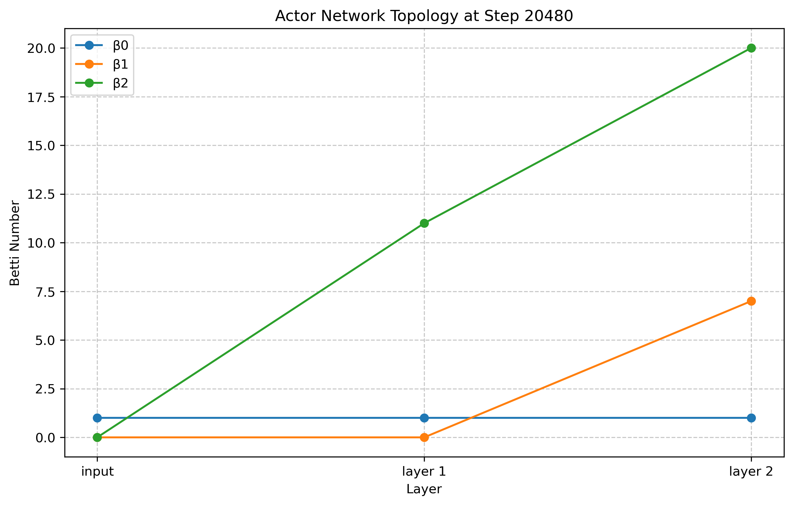
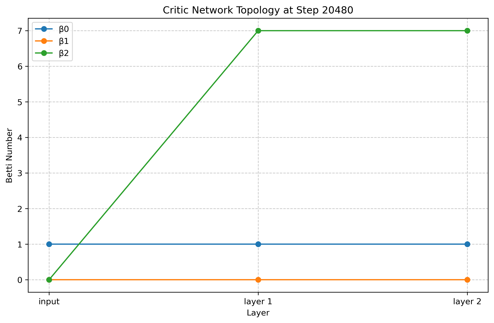
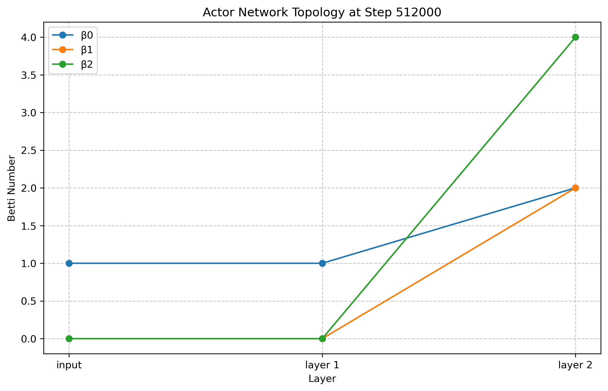
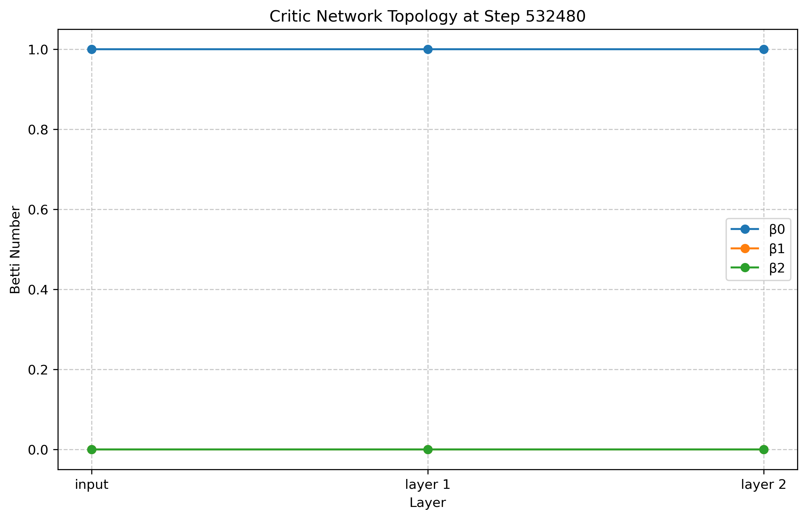
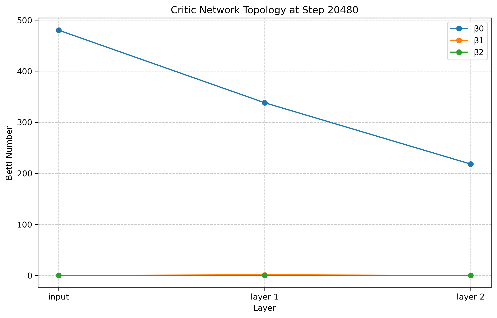
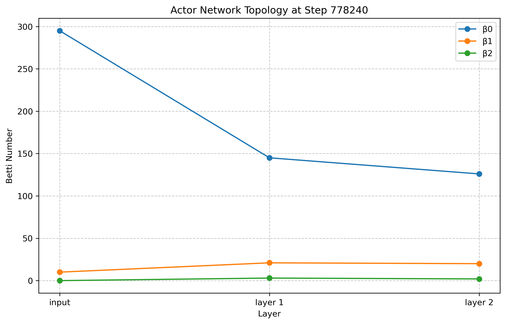
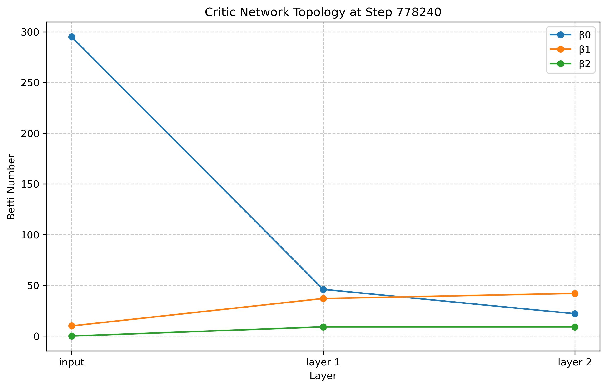
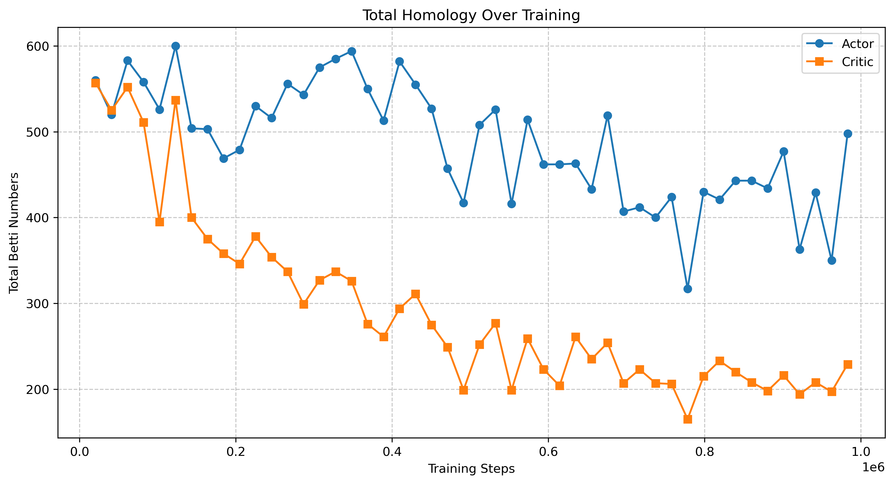
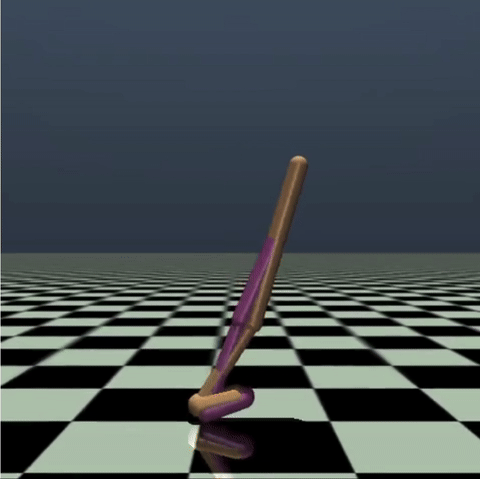

# NeuralTopology
This is a MVP repository for trying to understand what's truely happening inside the weight space of neural network when they are training upon specific tasks. Particularly, this will develope into seeing how the VNL system from [Talmo's lab](https://talmolab.org/) at the Salk Institute for Biological Studies may evolve different topological characteristics across DRL training.

## Expected Outcome 🧪
1. Helping us to better understand what is truly happening inside neural network
2. Providing another metric of comparing with experimental neuronal data (~homeomorphic).

## Topological Structures 🏗️
we perform TDA on the point-clouds of (1) sampled states (i.e., the inputs) and (2) the hidden-layer activations (both actor and critic) as those states are fed forward through the network.

- **Input space point-cloud:** 500 states in the original observation space $\mathbb{R}^d$ ($d=11$ for hopper and $d=17$ for walker).
- **Actor layer $i$ point-cloud:** 500 points in $\mathbb{R}^{64}$.
- **Actor layer $i$ point-cloud:** 500 points in $\mathbb{R}^{64}$.

For TDA, teh following is performed:
1. Sample data & actiavtions.
2. Compute some sort of distance metrics (Geodesic or Eucledian KNN).
3. Run Ripser for Betti Number & Persistent Homology.

## Preliminary 📝
Examining the training of an gymnasium mujoco `hopper-v4` & `walker-2d` agent. We can see the saturation of represenation as training progresses. We will see that for different task, the topological features that have been picking up by the agent may be drastically different. The training runs and topological characteristic changes over time are also captured in this [Wandb training log](https://wandb.ai/kaiwenbian107/hopper_ppo_topology_analysis?nw=nwuserkaiwenbian107).

- In hopper-4v environment, the deeper network seems to be amplifying topologicalfeatures from the input space.

- In walker-2d environment, the deeper network seems to be all trying to compress the lower dimension topological featuers from the input space into higher dimension topological structures. There seems to be an inverese corrolation between $\beta_2$ and $\beta_1$ across training (i.e. drop in $\beta_1$ and raise in $\beta_2$).

### Hopper-v4
| Actor Topology at 20480 Environmental Step    | Critic Topology at 20480 Environmental Step           |
|--------------------------------------|--------------------------------------|
|  |  |
| Actor Topology at 532480 Environmental Step   | Critic Topology at 532480 Environmental Step          |
|  |  |
| Betti Number Trend   | Hopper-v4 Rendering at 532480 Step          |
|  |  |

### Walker-2d
| Actor Topology at 20480 Environmental Step    | Critic Topology at 20480 Environmental Step           |
|--------------------------------------|--------------------------------------|
|  |  |
| Actor Topology at 778240 Environmental Step   | Critic Topology at 778240 Environmental Step          |
|  |  |
| Betti Number Trend   | Walker-2d Rendering at 778240 Step          |
|  |  |

## Acknowledgements
This codebase structure implementation is based on the paper ["TOPOLOGY OF DEEP NEURAL NETWORKS"](https://arxiv.org/pdf/2004.06093).